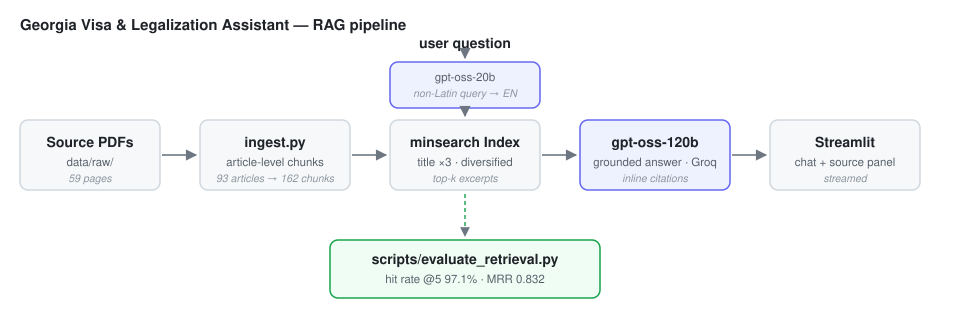

# Georgia Visa & Legalization Assistant

A retrieval-augmented Q&A app for questions about visas, residence permits, and the
legal status of foreigners in Georgia. Questions are answered **only** from indexed
Georgian legislation, and every answer cites the articles it relies on.

Built along the lines of the [LLM Zoomcamp](https://github.com/DataTalksClub/llm-zoomcamp)
project structure: ingestion → retrieval → RAG → evaluation → UI, with
[minsearch](https://github.com/alexeygrigorev/minsearch) for retrieval,
[Groq](https://console.groq.com/) (`openai/gpt-oss-120b`) for generation, and
Streamlit for the frontend.



## The problem

Georgia's rules for foreigners live in dense legislation written for lawyers. Someone
asking "how long can I stay?" or "can I work on this permit?" has to find the right
article among ~90 of them, then read around its exceptions and cross-references.

General-purpose chatbots answer these questions from half-remembered blog posts and
invent article numbers. This project constrains the model to a specific corpus and
shows the source text next to every answer, so the user can check it.

## Data

| | |
|---|---|
| Source | Law of Georgia on the Legal Status of Aliens and Stateless Persons |
| Publisher | `matsne.gov.ge` (official English translation) |
| Size | 59 pages → 93 articles → **162 chunks** |

Ingestion (`legalization_assistant/ingest.py`) parses the PDF with PyMuPDF, exploiting
the fact that the corpus is already structured as Section → Chapter → Article:

- **One chunk per article**, so a retrieved passage is a citable legal unit rather
  than an arbitrary window. Long articles are split on paragraph boundaries only
  (`MAX_CHUNK_CHARS`), and each part keeps its article heading and metadata —
  including the page its own text starts on, since 38 of the 93 articles run
  across a page break.
- **Superscript-aware.** Amending laws insert articles as `Article 20¹`. Flat text
  extraction turns that into `Article 201` — an article that does not exist. Chunks
  are built span-by-span so the superscript survives in both headings and
  cross-references.
- **Noise stripped**: page footers, publisher URLs, and document numbers. Amendment
  trails ("Law of Georgia No 1803 of 25 June 2026") are pulled out of the body into an
  `amendments` field and shown as "last amended" in the UI.

To add another law, drop its PDF into `data/raw/` and re-run the ingestion — the
parser is not specific to this document, and the UI gets a per-document filter.

## Retrieval

`minsearch.Index` over four text fields (`title`, `chapter`, `section`, `text`) with
`doc_id` and `article` as keyword fields for filtering.

Three things on top of a plain index, all of which came out of measurement:

- **Title boosting** (`title` ×3). Article titles carry the words users actually type.
  Boosting `chapter` as well *hurt*, because a chapter heading matches every article
  underneath it — see the sweep below.
- **Result diversification.** Parts of one long article all score alike, so Article 15
  alone could fill every slot and hide the other relevant articles. At most
  `MAX_PARTS_PER_ARTICLE` (2) parts of the same article may occupy results; the search
  over-fetches and filters.
- **Statutory synonyms.** The law says *expulsion*, never *deportation*; *alien*, never
  *foreigner*; *visa categories*, never *visa types*. A keyword index cannot bridge
  that, so everyday terms have their statutory equivalents appended to the query
  (`STATUTORY_SYNONYMS` in `search.py`). "What types of visas are there?" only reaches
  Article 7 with this on.

Questions in a non-Latin script (Russian, Georgian) cannot match an English index at
all, so they are first rewritten into English search terms by `gpt-oss-20b` at
`temperature=0` — non-deterministic rewrites made retrieval wobble run to run.
Latin-script questions skip that call entirely, so the common path costs nothing extra.

## RAG flow

Retrieved chunks are rendered with their article number, title, location in the law,
and amendment date, then passed to `openai/gpt-oss-120b` on Groq under a system prompt
that requires it to answer only from the excerpts, cite articles inline, surface
conditions and exceptions rather than the bare general rule, say plainly when the
excerpts do not cover the question, and answer in the user's language.

gpt-oss returns its chain of thought in a separate `reasoning` field, so the streamed
`content` deltas are answer text alone and go straight to the UI with no filtering.

Follow-up turns carry only the plain question/answer text, not each turn's excerpts.
That slows the prompt's growth but does not stop it, so history is also capped at
`MAX_HISTORY_CHARS` and the oldest turns are dropped first — the prompt reaches a
fixed ceiling instead of growing until the quota rejects it.

## Evaluation

Retrieval sets the ceiling on answer quality, so it is measured directly.
`data/ground_truth_seed.csv` holds 35 hand-written question → article pairs;
`scripts/generate_ground_truth.py` builds a larger set with an LLM, writing
`question,doc_id,article` rows as it goes so a rate limit part-way through costs
only the remaining articles. Scoring matches on `doc_id` when the column is
present, so once a second law is indexed its `Article 15` cannot be counted as a
hit for the first law's.

```bash
uv run python scripts/evaluate_retrieval.py --sweep
```

| configuration | hit rate @5 | MRR @5 |
|---|---|---|
| uniform (no boosts) | 91.4% | 0.795 |
| **title ×3 (default)** | **97.1%** | **0.832** |
| title ×3 + chapter ×1.5 | 94.3% | 0.825 |
| title ×8 | 94.3% | 0.817 |
| body text only | 68.6% | 0.519 |

The default configuration retrieves the correct article for 34 of 35 questions, usually
at rank 1. Over-boosting titles (×8) or boosting chapters both make it worse.

One honest caveat on these numbers: the seed questions are written in fairly statutory
vocabulary, so they under-represent how people actually ask. Synonym expansion costs a
little MRR here (0.846 → 0.832) while fixing colloquial questions the seed set does not
contain — that trade is why it is on by default.

## Running it

```bash
uv sync
cp .env.example .env          # then add your GROQ_API_KEY
uv run python scripts/prepare_data.py
uv run streamlit run app.py
```

`prepare_data.py` is optional — the corpus is built on first use if it is missing.

Ask a single question without the UI:

```bash
uv run python scripts/ask.py "How long is a residence permit valid?"
```

## Interface

Streamlit chat UI with streamed answers. Under each answer, an expander shows the
retrieved excerpts with article, chapter, page, and amendment date. The sidebar
controls how many excerpts to retrieve, which source document to search, and whether
to translate non-English questions.

## Project layout

```
legalization_assistant/
  config.py     paths, model ids, retrieval defaults
  ingest.py     PDF → article chunks
  search.py     minsearch index, synonym expansion, diversification
  rag.py        prompt assembly, query translation, streamed answers
  app.py        Streamlit UI
scripts/
  prepare_data.py          build the chunk corpus
  ask.py                   one-shot CLI
  evaluate_retrieval.py    hit rate / MRR, with --sweep
  generate_ground_truth.py LLM-generated evaluation set
data/
  raw/                     source PDFs
  ground_truth_seed.csv    hand-written evaluation set
```

## Limitations

- **One law indexed.** It covers entry, visas, residence permits, rights and duties,
  and expulsion, but not the government ordinances that carry much of the day-to-day
  detail (visa fee schedules, country lists, application forms).
- **Point-in-time text.** The PDF is a snapshot; the law changes. Amendment dates are
  shown so a stale answer is at least visible as stale.
- Not legal advice. Confirm anything consequential with the Public Service Development
  Agency or a qualified lawyer.
